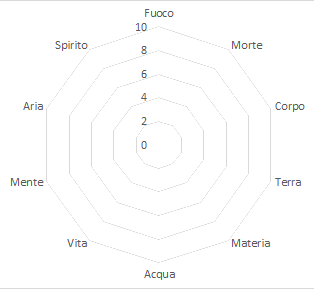

# Assegnazione dei punti
Il sistema di assegnazione dei punti di conoscenza delle scuole di magia, si basa sul principio di equilibrio tra le scuole opposte, portando a sviluppare un sistema che ad ogni aumento in una scuola, si avrà come conseguenza una riduzione inversamente proporzionale nella scuola opposta.

Ogni aumento in una scuola comporta un calo significativo in quella opposta, l'obiettivo è di creare e mantenere un equilibrio dinamico in cui i giocatori devono bilanciare potere e debolezze, promuovendo un gioco strategico e avvincente oltre che molto interpretativo.

Questo sistema vuole incoraggiare la specializzazione, ma allo stesso tempo anche la consapevolezza strategica, poiché ogni scelta di aumento comporta conseguenze immediate sul bilancio globale delle abilità magiche.

## Sistema di Assegnazione dei Punti

### Distribuzione dei punti iniziali:  
Per garantire una base equilibrata da cui partire, Ogni personaggio inizia con 20 punti da distribuire tra le 10 scuole di magia. I giocatori possono assegnare un massimo di 3 punti per scuola, senza alcun obbligo su quali scuole scegliere.  
  

  

  
### Incremento dei gradi di conoscenza
 **- Punteggio da 0 a 5:** Non ci sono effetti sulle scuole opposte. Ogni scuola è indipendente fino a questo livello.  
 **- Punteggio dal 6 in Su:** Se un giocatore raggiunge il punteggio di 6 o superiore in una scuola, la scuola opposta diminuisce di 1 punto, rappresentando l'effetto massimo di contrapposizione.

Fuoco ↔ Acqua  
Terra ↔ Aria  
Vita ↔ Morte  
Spirito ↔ Materia  
Mente ↔ Corpo  

#### Esempio di Applicazione
Immaginiamo un personaggio appena creato, con 20 punti distribuiti tra le scuole di magia. Il giocatore decide di assegnare i punti iniziali in questo modo:  

•	Fuoco: 3  
•	Acqua: 3 (opposta a Fuoco)  
•	Terra: 2  
•	Aria: 2 (opposta a Terra)  
•	Morte: 3  
•	Vita: 3 (opposta a Morte)  
•	Corpo: 1  
•	Mente: 1 (opposta a Corpo)  
•	Spirito: 1  
•	Materia: 1 (opposta a Spirito)  

Durante le sessioni, il giocatore ha aumentato Fuoco di 2 punti, portandolo a 5, decide ora di incrementare ulteriormente la scuola di magia Fuoco portando il grado di conoscenza a 6 e attivando la riduzione nella scuola opposta (Acqua).

**Aumento**
•	Fuoco +1 punto, passando da 5 a 6.

**Riduzione**
•	Acqua (opposta a Fuoco) -1 punto, passando da 3 a 2.

**Il nuovo set di punti sarà:**

•	Fuoco: 6  
•	Acqua: 2 (opposta a Fuoco)  
•	Terra: 2  
•	Aria: 2 (opposta a Terra)  
•	Vita: 3  
•	Morte: 3 (opposta a Morte)  
•	Corpo: 1  
•	Mente: 1 (opposta a Corpo)  
•	Spirito: 1  
•	Materia: 1 (opposta a Spirito)

### Incrementi e diminuzionei estreme
In caso di aumento oltre il punteggio di 5, sarà possibile per le scuole opposte portare il punteggio in negativo, con conseguenze fisiche o mentali sullo stesso incantatore, legate alla scuola di magia incrementata. Allo stesso modo, in caso di incremento oltre il 15, il personaggio dovrebbe iniziare a sviluppare delle conseguenze a discrezione del DM, sempre legate alla scuola di magia.

### Tabella punteggi inferiori a 0 ###

| Scuola | -1 | -2 | -3 |
| :----: | :-----------------------------: | :-------------------------------: | :----------------------------: |
| Fuoco	| +1 danno da fiamme o calore. | +2 danni e svantaggio contro effetti di fuoco. | Fuoco e calore non lo proteggono: anche un fuocherello lo brucia come brace. |
| Acqua	| +1 danno da freddo o acqua. | +2 danni e svantaggio contro effetti d’acqua/gelo. | Non è in grado di nuotare, non può trattenere il respiro a lungo e rischia di annegare anche in poca acqua. |
| Terra	| Il personaggio fatica a mantenere l’equilibrio e subisce -1 di penalità. | Svantaggio di -2 ai tiri per resistere a spinte, sbilanciamenti e condizioni che ne minano la stabilità. | Il legame col suolo è corrotto: lascia impronte profonde o crepe dove passa, ed è più facile che venga sepolto, immobilizzato o bloccato da frane, sabbie mobili, radici. |
| Aria | +1 danno da vento o fulmini. | +2 danni e svantaggio contro incantesimi d’aria. | I venti lo osteggiano: correnti contrarie, respiro affannoso, cadute più pericolose. |
| Vita | +1 danno extra da magie curative. | Cura dimezzata dagli incantesimi di Vita, subisce +2 danni dagli effetti positivi.	| Non può più ricevere alcuna cura magica di Vita; i guaritori percepiscono un “vuoto vitale” in lui. |
| Morte		| +1 danno da non morti o necromanzia. | +2 danni e svantaggio contro effetti necrotici. | È percepito come preda: i non morti lo attaccano per primo e non può resistere al loro richiamo. |
| Spririto | +1 danno da entità o magie spirituali.	| +2 danni e svantaggio contro incantesimi di Spirito. | Le anime altrui lo disturbano: sente voci, presenze e non può resistere a possessioni.	|
| Materia	| +1 danno extra da colpi contundenti o effetti di trasmutazione.	| Svantaggio ai tiri contro trasformazioni e deformazioni (es. pietrificazione, alterazioni alchemiche). Oggetti impugnati diventano fragili o si consumano più velocemente. | La sua stessa materia è instabile: può lasciare pezzi di sé (capelli che si sbriciolano in polvere, pelle che si screpola), o perfino passare attraverso la materia involontariamente in momenti di stress. |
| Mente	| +1 danno da effetti mentali. | +2 danni e svantaggio contro magie mentali. | Mente fragile: rischia di perdere ricordi o subire allucinazioni anche senza magia diretta. |
| Corpo	| +1 danno da effetti fisici (veleni, malattie etc). | +2 danni e svantaggio contro incantesimi sul corpo. | Corpo vulnerabile: resistenza dimezzata a veleni/malattie, cicatrici permanenti da ferite. |

### Tabella punteggi superiori a 15 ###

| Scuola | 15 | 16 | 17 | 18 | 19 | 20 |
| :----: | :-: | :-: | :-:| :-: | :-: | :-: |
| Fuoco | La tua pelle è sempre calda al tatto. | Piccole faville scoppiettano quando sei emozionato. | Le fiamme ardono più vivide in tua presenza. | Le fiamme tendono a piegarsi verso di te. | L’aria intorno a te è calda come brace, e le scintille nascono spontanee. | Sei puro fuoco, la tua sola presenza può accendere incendi e il tuo tocco fondere metalli. |
| Acqua | Emani odore di pioggia o mare. | La tua voce ha un timbro fluido e melodico. | Le superfici d’acqua si increspano quando ti avvicini.          | L’acqua evita di bagnarti troppo.          | Piccole pozze o piogge leggere si formano spontanee accanto a te.              | Puoi muovere le maree o calmare fiumi col pensiero.                      |
| Terra | Il tuo passaggio non lascia impronte sul terreno.     | Irradi una calma innaturale.                                        | I sassi e la terra si assestano al tuo passaggio.               | Le pietre sembrano leggermente attratte da te.                      | Rocce e radici si muovono per proteggerti o ostacolare altri.                  | La terra risponde al tuo volere, aprendosi o chiudendosi.                 |
| Aria | Una lieve brezza ti accompagna sempre.               | I tuoi capelli e vestiti si muovono come mossi da vento invisibile. | Polvere e foglie si sollevano al tuo passaggio.                 | Le correnti d’aria cambiano direzione vicino a te.                  | Un vento costante ti avvolge, sospingendo le tue parole e respingendo detriti. | Puoi evocare fulmini e burrasche con la sola presenza.                        |
| Vita | Le tue guance appaiono sempre floride e sane.        | Le piante vicine sembrano più verdi.                                | Gli animali ti osservano con curiosità.                         | I fiori sbocciano al tuo passaggio.                                 | La tua aura stimola guarigioni lievi negli altri.                              | La corruzione si ritira e i malati rifioriscono al tuo cospetto.                    |
| Morte | L’aria intorno a te è leggermente più fredda.        | Le fiamme tremolano e le candele si spengono facilmente.            | I corvi e altri necrofagi si avvicinano a te.                   | Le ombre si allungano verso di te.                                  | I morenti percepiscono la tua vicinanza e presagiscono la fine.                | I non morti si inchinano, ed il tuo tocca può uccidei. La morte ti riconosce come suo emissario. |
| Spirito | I tuoi sogni diventano più vividi.                   | La tua voce ha un’eco lieve.                                        | Presenze benevole si manifestano accanto a te (luci, sussurri). | Gli spiriti ti osservano e accorrono vicino.                        | Le anime dei morti ti sussurrano nei momenti di silenzio.                      | Sei ponte vivente tra i mondi: gli spiriti ti seguono e parlano attraverso di te.                     |
| Materia | Le tue creazioni sono permanenti.                | Il metallo nelle tue mani brilla più del normale.                   | Le sostanze vicine tendono a solidificarsi.                     | Gli oggetti che tocchi diventano più robusti.                       | Le armi e gli edifici vicini si rinforzano spontaneamente.                     | La materia si piega e si indurisce sotto il tuo volere.                          |
| Mente | Le persone ti trovano inspiegabilmente affascinante. | Gli altri percepiscono le tue emozioni senza che tu parli.          | Chi ti ascolta resta rapito anche senza magia.                  | Le tue parole hanno peso, come se toccassero direttamente la mente. | Le folle ti seguono istintivamente, gli animali obbediscono al tuo sguardo.    | Sei mente dominante: puoi imporre silenzio o soggezione con la sola presenza.                         |
| Corpo | Appari sempre in salute.                             | Le tue cicatrici guariscono in fretta.                              | Chi ti è vicino percepisce la tua energia vitale.               | I compagni si sentono più resistenti accanto a te.                  | La tua presenza ispira vigore e resistenza negli altri.                        | Fatica, malattie e dolore non ti toccano.                                      |

#### Esempi di conseguenze
Ecco alcuni esempi narrativi per gli incrementi e le diminuzioni estreme nel sistema di magia:  

**Morte**: Dopo anni di studio nei segreti oscuri, un mago sacrifica completamente le sue capacità di dare la vita o curare creature, per diventare un maestro della morte. Tuttavia, la sua maestria necromantica influisce negativamente sulla scuola di magia oppoeta (Vita) e gli oggetti che tocca sembrano invecchiare o decomporsi.  

**Materia**: Un mago diventa un maestro nel mutare la materia a volontà, trasformando il piombo in oro e le rocce in aria. Ma l'arte della divinazione (Spirito) gli sfugge completamente, rendendolo cieco ai segreti del futuro e al flusso del tempo.  

**Fuoco**: Un mago, specializzato nell’arte del fuoco, manifesta un'aura costante di calore intorno a sé. Tuttavia, il suo corpo diventa più fragile contro il freddo, e non riesce nemmeno a evocare una leggera brezza o manipolare acqua.  

**Acqua**: Un incantatore padroneggia il gelo al punto che la temperatura del suo corpo è sempre fredda come il ghiaccio. Anche nelle giornate calde, le sue impronte lasciano brina, ma la sua incapacità di maneggiare il fuoco lo rende estremamente vulnerabile al calore.  

**Mente**: Un mago che sviluppa una grande abilità nel muovere oggetti con la mente riesce a far fluttuare persino enormi massi. Tuttavia, il suo corpo fisico diventa debole, non riesce più a sollevare nemmeno un oggetto leggero con le mani.  
